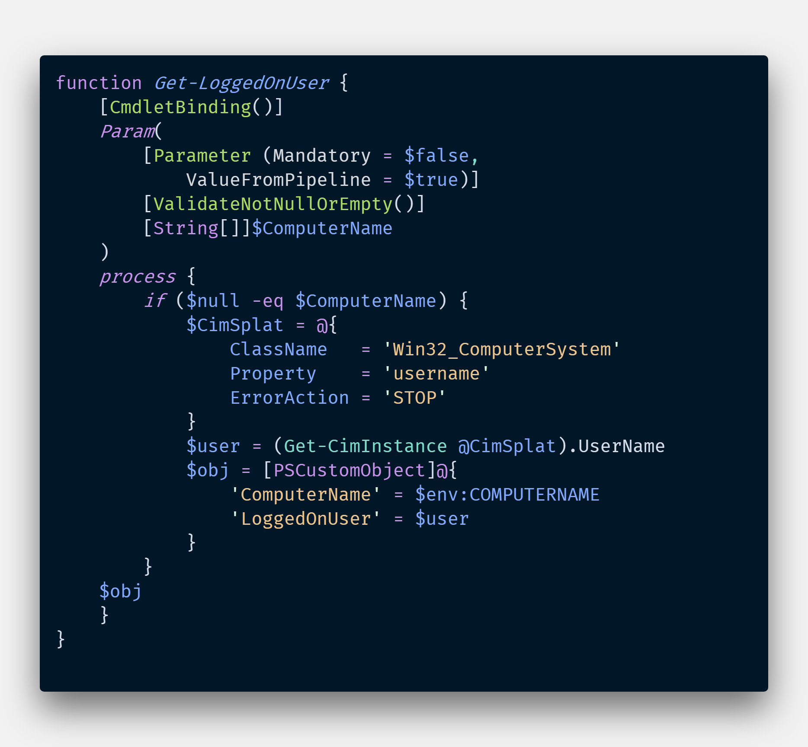

# PowerShell

---
## PowerShell 是萬用瑞士刀
@ul[spaced text-white]
- 腳本語言 (scripting language)
- 系統管理工具 (Admin tool)
- 自動化工具 (Desire State Configuration)
- 測試工具 (Pester, Operational Validation Framework)
- Serverless function (Azure Function, AWS PowerShell Lambda)

---
@snap[west span-40 text-white]
腳本語言 (scripting language)
@snapend

@snap[east span-60]

@snapend

---
@snap[west span-40 text-white]
系統管理工具 (Admin tool)
@snapend
@snap[east span-60]
### 例如:

+ Registry
+ Windows Update
+ PowerShell Remoting

@snapend

---

@snap[east span-50]

@snapend

@snap[south span-100 text-white]
Snap Layouts let you create custom slide designs directly within your markdown.
@snapend

---
@title[Add A Little Imagination]

@snap[north-west h4-white]
#### And start presenting...
@snapend

@snap[west span-55]
@ul[spaced text-white]
- You will be amazed
- What you can achieve
- *With a little imagination...*
- And **GitPitch Markdown**
@ulend
@snapend

@snap[east span-45]
@img[shadow](assets/img/conference.png)
@snapend

---
## Q & A