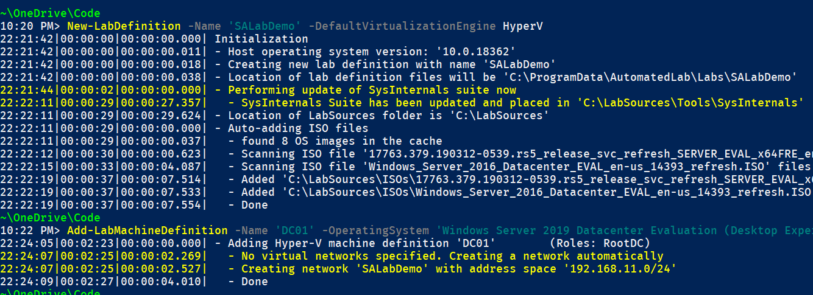

# PowerShell

---
## PowerShell 是萬用瑞士刀
@ul[spaced text-white]
- 腳本語言 (scripting language)
- 系統管理工具 (Admin tool)
- 測試工具 (Pester, Operational Validation Framework)
- 自動化工具 (Desire State Configuration)
- Serverless function (Azure Function, AWS PowerShell Lambda)

---
@snap[west span-40 text-white]
腳本語言 (scripting language)
@snapend

@snap[east span-60]

@snapend

---
@snap[west span-40 text-white]
系統管理工具 (Admin tool)
@snapend
@snap[east span-60]
### 例如:

@ul[spaced text-white]
- Registry
- Event Log
- Windows Update
- REST API
- PowerShell Remoting
@snapend

---

## Demo - 查詢 Windows Update client id

```
Get-ItemProperty HKLM:\SOFTWARE\Microsoft\Windows\CurrentVersion\WindowsUpdate\
```
---

@img[shadow](assets/img/whereisitsold.jpg)

---
## 工欲善其事

@ul[spaced text-white]
- PowerShell 5.1 - Windows 內建
- PowerShell Core 6 - GitHub
- PowerShell Gallery - 模組
- Visual Studio Code

---

## Demo - 測試工具, Pester

```
Invoke-Pester
```
---
## Demo (時間夠時) - Lab with AutomatedLab


---
## Demo (時間夠時) - Serverless function with AWS PowerShell Lambda

---
## Q & A